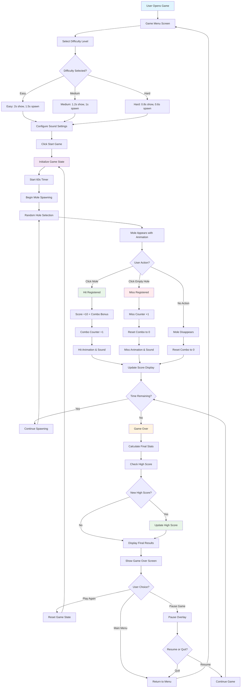

# Whack-a-Mole Game


## 🎯 Overview

A modern, feature-rich **Whack-a-Mole Game** built with React.js and pure CSS animations. This interactive reflex game challenges players to click on moles as they randomly appear from holes, featuring multiple difficulty levels, combo systems, sound effects, and comprehensive scoring mechanics.

## ✨ Features

### Core Gameplay
- **🎮 Interactive 3x3 Grid**: Classic whack-a-mole layout with 9 holes
- **⏱️ 60-Second Rounds**: Fast-paced gameplay with countdown timer
- **🎯 Precision Scoring**: 10 points per hit with combo bonuses
- **🔥 Combo System**: Build streaks for bonus points and visual effects
- **📊 Real-time Statistics**: Live accuracy tracking and performance metrics

### Difficulty Levels
- **🟢 Easy Mode**: Moles appear for 2 seconds, spawn every 1.5 seconds
- **🟡 Medium Mode**: Moles appear for 1.2 seconds, spawn every 1 second
- **🔴 Hard Mode**: Moles appear for 0.8 seconds, spawn every 0.6 seconds

### Advanced Features
- **🏆 High Score System**: Persistent storage for best scores per difficulty
- **🎵 Sound Effects**: Web Audio API-generated hit and miss sounds
- **⏸️ Pause/Resume**: Game state management with pause overlay
- **📱 Responsive Design**: Optimized for desktop, tablet, and mobile
- **🎨 Smooth Animations**: CSS-powered mole animations and effects
- **♿ Accessibility**: Keyboard navigation and screen reader support

### Visual Effects
- **✨ Hit Animations**: Score pop-ups and particle effects
- **💨 Miss Indicators**: Visual feedback for missed clicks
- **🔥 Combo Glow**: Special effects for high combo streaks
- **🎭 Mole Variants**: Different mole characters for variety
- **🌈 Gradient Backgrounds**: Dynamic color schemes

## 🚀 Demo

### Screenshots
```
[Whack-a-Mole Game Interface]
┌─────────────────────────────────────────────┐
│  🔨 WHACK-A-MOLE                           │
│  Test your reflexes and reaction time!      │
├─────────────────────────────────────────────┤
│  Score: 1,250    Time: 0:45    Accuracy: 85%│
│  Difficulty: MEDIUM    [⏸️ Pause] [🏠 Menu] │
│                                             │
│  ┌─────┐ ┌─────┐ ┌─────┐                   │
│  │  🐹  │ │     │ │     │                   │
│  └─────┘ └─────┘ └─────┘                   │
│  ┌─────┐ ┌─────┐ ┌─────┐                   │
│  │     │ │  🐭  │ │     │                   │
│  └─────┘ └─────┘ └─────┘                   │
│  ┌─────┐ ┌─────┐ ┌─────┐                   │
│  │     │ │     │ │  🐰  │                   │
│  └─────┘ └─────┘ └─────┘                   │
│                                             │
│  🔥 COMBO x12 🔥                           │
├─────────────────────────────────────────────┤
│  🎯 GAME OVER!                             │
│  Final Score: 1,250                        │
│  High Score (Medium): 1,250                │
│  Accuracy: 85% (34/40)                     │
│  Max Combo: 12                             │
│  🏆 NEW HIGH SCORE! 🏆                     │
│  [Play Again] [Main Menu]                  │
└─────────────────────────────────────────────┘
```

## 🛠️ Installation

### Prerequisites
- **Node.js** (version 14.0 or higher)
- **npm** or **yarn** package manager
- Modern web browser with ES6+ support

### Quick Start
1. **Clone the repository**
   ```bash
   git clone https://github.com/yourusername/whack-a-mole-game.git
   cd whack-a-mole-game
   ```

2. **Install dependencies**
   ```bash
   npm install
   # or
   yarn install
   ```

3. **Start development server**
   ```bash
   npm start
   # or
   yarn start
   ```

4. **Open in browser**
   - Navigate to `http://localhost:3000`
   - Game will automatically open in your default browser

### Build for Production
```bash
npm run build
# or
yarn build
```

## 📖 Usage

### Step-by-Step Guide

1. **Choose Difficulty**
   - Select from Easy, Medium, or Hard difficulty levels
   - Each level has different mole timing and spawn rates
   - View your current high score for each difficulty

2. **Configure Settings**
   - Toggle sound effects on/off
   - Review game instructions and controls

3. **Start Playing**
   - Click "START GAME" to begin
   - Watch for moles appearing from holes
   - Click on moles quickly before they disappear

4. **Build Combos**
   - Hit consecutive moles to build combo streaks
   - Combo bonuses: +5 points every 5 hits in a row
   - Special visual effects activate at high combos

5. **Track Performance**
   - Monitor your score, time remaining, and accuracy
   - Use pause feature if needed
   - Try to beat your high score!

### Controls
- **Mouse Click**: Hit moles and navigate menus
- **Spacebar**: Pause/resume game (during gameplay)
- **Escape**: Return to main menu
- **Enter**: Start game (from menu)

### Scoring System

| Action | Points | Notes |
|--------|--------|-------|
| **Hit Mole** | 10 | Base points per successful hit |
| **Combo Bonus** | +5 | Every 5 consecutive hits |
| **Miss Penalty** | 0 | No points deducted, but combo resets |
| **Mole Escape** | 0 | Combo resets when mole disappears |

### Difficulty Comparison

| Difficulty | Mole Show Time | Spawn Rate | Challenge Level |
|------------|----------------|------------|-----------------|
| **Easy** | 2.0 seconds | 1.5 seconds | Beginner-friendly |
| **Medium** | 1.2 seconds | 1.0 seconds | Balanced challenge |
| **Hard** | 0.8 seconds | 0.6 seconds | Expert level |

## 🎮 Game Mechanics

### Mole Spawning System
The game uses a sophisticated spawning algorithm:

1. **Random Hole Selection**: Chooses from available holes (not currently occupied)
2. **Timing Variation**: Adds random variance to spawn and show times
3. **Collision Prevention**: Ensures only one mole per hole at a time
4. **Progressive Difficulty**: Maintains consistent challenge throughout the game

### Combo System
```javascript
// Combo calculation example
const basePoints = 10;
const comboBonus = Math.floor(combo / 5) * 5;
const totalPoints = basePoints + comboBonus;

// Combo levels
if (combo >= 10) {
  // Mega combo effects
} else if (combo >= 5) {
  // Super combo effects
}
```

### Performance Optimization
- **Efficient Rendering**: React hooks for optimal re-renders
- **Memory Management**: Proper cleanup of timers and intervals
- **Background Optimization**: Pauses updates when tab is hidden
- **Debounced Updates**: Smooth animations without performance impact

## 🔧 Technologies Used

### Frontend Technologies
- **React 18.2.0**: Modern React with hooks and functional components
- **JavaScript ES6+**: Modern JavaScript features and syntax
- **CSS3**: Advanced styling with animations and transitions
- **HTML5**: Semantic markup and accessibility features

### React Features
- **useState**: State management for game data
- **useEffect**: Side effects and lifecycle management
- **useCallback**: Performance optimization for event handlers
- **useRef**: Direct DOM access and timer management
- **Custom Hooks**: Reusable logic for game mechanics

### Browser APIs
- **Web Audio API**: Real-time sound generation
- **Local Storage**: High score persistence
- **Page Visibility API**: Background optimization
- **Intersection Observer**: Performance monitoring

### Development Tools
- **Create React App**: Project setup and build configuration
- **React Scripts**: Development server and build tools
- **ESLint**: Code quality and consistency
- **Prettier**: Code formatting

### Design Features
- **CSS Grid & Flexbox**: Modern layout techniques
- **CSS Animations**: Smooth transitions and effects
- **CSS Custom Properties**: Dynamic theming
- **Responsive Design**: Mobile-first approach

## 📁 Project Structure

```
whack-a-mole-game/
├── public/
│   ├── index.html              # Main HTML template
│   └── favicon.ico            # Game icon
├── src/
│   ├── components/            # React components
│   │   ├── GameGrid.js        # Main game board
│   │   ├── GameMenu.js        # Start screen and settings
│   │   ├── MoleHole.js        # Individual hole component
│   │   ├── ScorePanel.js      # Score and timer display
│   │   └── SoundManager.js    # Audio system
│   ├── App.js                 # Main application component
│   ├── App.css               # Application styles
│   ├── index.js              # React entry point
│   └── index.css             # Global styles
├── package.json              # Dependencies and scripts
├── README.md                 # Project documentation
└── .gitignore               # Git ignore rules
```

### Component Architecture

#### `App.js` (Main Controller)
- Game state management
- Timer and scoring logic
- High score persistence
- Component orchestration

#### `GameMenu.js` (Start Screen)
- Difficulty selection
- High score display
- Settings configuration
- Game instructions

#### `GameGrid.js` (Game Board)
- 3x3 mole hole layout
- Combo visual effects
- Grid state management
- Click event handling

#### `MoleHole.js` (Individual Holes)
- Mole appearance animations
- Hit/miss visual feedback
- Particle effects
- Sound trigger events

#### `ScorePanel.js` (HUD)
- Real-time score display
- Timer with warnings
- Accuracy calculation
- Game controls

#### `SoundManager.js` (Audio)
- Web Audio API integration
- Hit and miss sound effects
- Volume and mute controls
- Performance optimization

## 🎨 Customization

### Color Scheme
```css
:root {
  --primary-gradient: linear-gradient(135deg, #1a1a2e 0%, #16213e 50%, #0f3460 100%);
  --accent-color: #ffd700;
  --hit-color: #4caf50;
  --miss-color: #f44336;
  --combo-color: #ff4500;
}
```

### Animation Settings
```css
:root {
  --mole-appear-duration: 0.3s;
  --mole-hit-duration: 0.4s;
  --combo-glow-duration: 1s;
  --score-float-duration: 0.8s;
}
```

### Difficulty Customization
```javascript
const MOLE_SHOW_TIME = {
  easy: 2000,    // 2 seconds
  medium: 1200,  // 1.2 seconds
  hard: 800      // 0.8 seconds
};

const MOLE_SPAWN_RATE = {
  easy: 1500,    // 1.5 seconds
  medium: 1000,  // 1 second
  hard: 600      // 0.6 seconds
};
```

### Responsive Breakpoints
```css
/* Mobile First */
@media (max-width: 480px) { /* Small mobile */ }
@media (max-width: 768px) { /* Mobile/tablet */ }
@media (max-width: 1024px) { /* Tablet/small desktop */ }
@media (min-width: 1025px) { /* Desktop */ }
```

## 🤝 Contributing

We welcome contributions! Here's how you can help:

### Getting Started
1. Fork the repository
2. Create a feature branch (`git checkout -b feature/AmazingFeature`)
3. Commit your changes (`git commit -m 'Add some AmazingFeature'`)
4. Push to the branch (`git push origin feature/AmazingFeature`)
5. Open a Pull Request

### Contribution Guidelines
- Follow existing code style and conventions
- Add comments for complex game logic
- Test on multiple browsers and devices
- Update documentation as needed
- Include screenshots for UI changes

### Areas for Contribution
- 🐛 **Bug Fixes**: Report and fix issues
- ✨ **New Features**: Power-ups, multiplayer, tournaments
- 🎨 **UI/UX**: Design improvements and animations
- 🎵 **Audio**: Enhanced sound effects and music
- 📱 **Mobile**: Touch gestures and haptic feedback
- 🏆 **Leaderboards**: Online high score system
- 🎮 **Game Modes**: Time attack, survival, challenge modes

### Development Setup
```bash
# Clone your fork
git clone https://github.com/yourusername/whack-a-mole-game.git

# Install dependencies
npm install

# Start development server
npm start

# Run tests
npm test

# Build for production
npm run build
```

### Code Style
- Use functional components with hooks
- Follow React best practices
- Use meaningful variable and function names
- Add PropTypes for component props
- Write unit tests for game logic

## 📝 License

This project is licensed under the MIT License - see the [LICENSE](LICENSE) file for details.

### MIT License Summary
- ✅ **Commercial Use**: Use in commercial projects
- ✅ **Modification**: Modify and adapt the code
- ✅ **Distribution**: Share and distribute freely
- ✅ **Private Use**: Use for personal projects
- ❌ **Liability**: No warranty or liability
- ❌ **Trademark Use**: No trademark rights included

## 👨‍💻 Developer

**Developed by Saket Kumar Sinha**

## 🙏 Acknowledgments

- **Inspiration**: Classic arcade whack-a-mole games
- **Design**: Modern web game design principles
- **Icons**: Emoji icons for universal compatibility
- **Fonts**: System fonts for optimal performance
- **Color Palette**: Carefully selected for accessibility
- **Animation Library**: Custom CSS animations for smooth gameplay

## 🔮 Future Enhancements

### Planned Features
- 🎮 **Multiple Game Modes**: Time attack, survival, challenge modes
- 🏆 **Online Leaderboards**: Global high score competition
- 🎵 **Background Music**: Ambient game music and themes
- 💥 **Power-ups**: Special abilities and bonus items
- 🎯 **Achievements**: Unlock system with badges and rewards
- 👥 **Multiplayer**: Real-time competitive gameplay
- 📱 **Mobile App**: Native iOS and Android versions
- 🎨 **Themes**: Multiple visual themes and customization

### Technical Improvements
- ⚡ **Performance**: WebGL rendering for smoother animations
- 🔊 **Audio**: Advanced sound system with spatial audio
- 📱 **PWA**: Progressive Web App with offline support
- 🎮 **Gamepad**: Controller support for console-like experience
- 🤖 **AI**: Smart difficulty adjustment based on performance
- 📊 **Analytics**: Detailed gameplay statistics and insights

---

## 💡 Tips & Tricks

### For High Scores
1. **Focus on Accuracy**: Maintain high hit rate over speed
2. **Build Combos**: Consecutive hits provide bonus points
3. **Practice Patterns**: Learn common mole spawn patterns
4. **Stay Calm**: Don't panic when time runs low

### For Best Experience
1. **Use Mouse**: More precise than trackpad
2. **Good Lighting**: Ensure screen visibility
3. **Comfortable Position**: Proper ergonomics for extended play
4. **Sound On**: Audio cues help with timing

### Performance Tips
1. **Close Other Tabs**: Ensure smooth gameplay
2. **Stable Internet**: For consistent performance
3. **Updated Browser**: Use latest browser version
4. **Hardware Acceleration**: Enable in browser settings

---

### Version History

- **v1.0.0** (2024): Initial release with core gameplay
- **v1.1.0** (2024): Added combo system and sound effects
- **v1.2.0** (2024): Enhanced UI and mobile responsiveness
- **v1.3.0** (2024): Performance optimizations and accessibility improvements

### Browser Compatibility

| Browser | Version | Status |
|---------|---------|--------|
| Chrome | 80+ | ✅ Fully Supported |
| Firefox | 75+ | ✅ Fully Supported |
| Safari | 13+ | ✅ Fully Supported |
| Edge | 80+ | ✅ Fully Supported |
| Opera | 67+ | ✅ Fully Supported |
| IE | 11 | ⚠️ Limited Support |

---

**Thank you for playing Whack-a-Mole! 🔨**

*Test your reflexes and have fun!*
